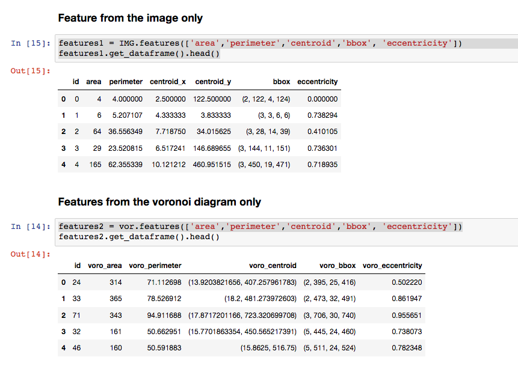
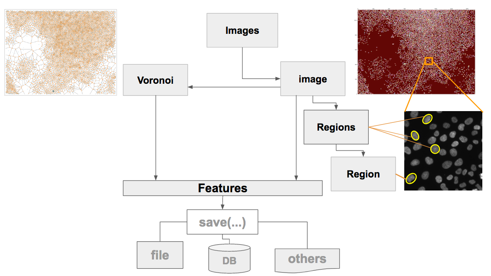

# Image Features Extraction Package

This package allows the fast extraction and classification of features from a set of images.

## [Package documentation](https://rempic.github.io/Image-Features-Extraction/)

## [Tutorial](./tutorial/remi_tutorial_image_features_extraction.ipynb)

This Python package allows the fast extraction and classification of features from a set of images. The resulting data frame can be used as training and testing set for machine learning classifier.


This package was originally developed to extract measurements of single cell nuclei from microscopy images (see figure above). The package can be used to extract features from any set of images for a variety of applications.
Below it is shown a map of Boston used for city density and demographic models.



## Features extraction for spatial classification of images

The image below shows a possible workflow for image feature extraction: two sets of images with different classification labels are used to produce two data sets for training and testing a classifier


## An example of Collection-object and Iterator implementation


The object 'Image' includes the function Voronoi(), which returns the object Voronoi of my package Voronoi_Features.
The Voronoi object can be used to measure the voronoi tassels of each image regions. It includes >30 measurements.
Below an example of voronoi diagrams from the image shown above




## Image features extraction for city density and demographic analysis modelling

Create the Images root object and laod the images contained in the folder


```python
% matplotlib inline
import matplotlib.pyplot as plt

import image_features_extraction.Images as fe


IMGS = fe.Images('../images/CITY')

IMG = IMGS.item(0)


print(IMG.file_name())


fig, ax = plt.subplots(figsize=(20, 20))

ax.imshow(IMGS.item(0).get_image_segmentation())

```

    ../images/CITY/Boston_Center.tif


    <matplotlib.image.AxesImage at 0x11f3e2400>


```python
features = IMG.features(['label', 'area','perimeter', 'centroid', 'moments'])

df2 = features.get_dataframe()

df2.head()
```


<div>
<style>
    .dataframe thead tr:only-child th {
        text-align: right;
    }

    .dataframe thead th {
        text-align: left;
    }

    .dataframe tbody tr th {
        vertical-align: top;
    }
</style>
<table border="1" class="dataframe">
  <thead>
    <tr style="text-align: right;">
      <th></th>
      <th>id</th>
      <th>label</th>
      <th>area</th>
      <th>perimeter</th>
      <th>centroid_x</th>
      <th>centroid_y</th>
      <th>moments</th>
    </tr>
  </thead>
  <tbody>
    <tr>
      <th>0</th>
      <td>0</td>
      <td>44</td>
      <td>4</td>
      <td>4.000000</td>
      <td>2.500000</td>
      <td>122.500000</td>
      <td>[[4.0, 2.0, 2.0, 2.0], [2.0, 1.0, 1.0, 1.0], [...</td>
    </tr>
    <tr>
      <th>1</th>
      <td>1</td>
      <td>45</td>
      <td>6</td>
      <td>5.207107</td>
      <td>4.333333</td>
      <td>3.833333</td>
      <td>[[6.0, 8.0, 14.0, 26.0], [5.0, 8.0, 14.0, 26.0...</td>
    </tr>
    <tr>
      <th>2</th>
      <td>2</td>
      <td>46</td>
      <td>64</td>
      <td>36.556349</td>
      <td>7.718750</td>
      <td>34.015625</td>
      <td>[[64.0, 302.0, 1862.0, 13058.0], [385.0, 1857....</td>
    </tr>
    <tr>
      <th>3</th>
      <td>3</td>
      <td>47</td>
      <td>29</td>
      <td>23.520815</td>
      <td>6.517241</td>
      <td>146.689655</td>
      <td>[[29.0, 102.0, 476.0, 2580.0], [78.0, 305.0, 1...</td>
    </tr>
    <tr>
      <th>4</th>
      <td>4</td>
      <td>48</td>
      <td>165</td>
      <td>62.355339</td>
      <td>10.121212</td>
      <td>460.951515</td>
      <td>[[165.0, 1175.0, 10225.0, 99551.0], [1807.0, 1...</td>
    </tr>
  </tbody>
</table>
</div>


```python
# SHOW THE FOUND CENTROIDS

fig, ax = plt.subplots(figsize=(20, 20))

plt.plot(df2.centroid_x,df2.centroid_y,'.r' )
```


    [<matplotlib.lines.Line2D at 0x119b1ea58>]


```python
h = plt.hist(df2.area,100)
```


# Image features extraction for cellular spatial analysis

Images show cell nuclei


```python

```


```python
% matplotlib inline
import matplotlib.pyplot as plt

import image_features_extraction.Images as fe


IMGS = fe.Images('../images/CA/1')


# the iterator at work ...
for IMG in IMGS:
    print(IMG.file_name())


```

    ../images/CA/1/ORG_8bit.tif
    ../images/CA/1/ORG_bin.tif


```python

fig, ax = plt.subplots(figsize=(20, 20))

ax.imshow(IMGS.item(1).get_image_segmentation())

```


    <matplotlib.image.AxesImage at 0x11ab282b0>


## An example of measurement and visualization of a property, e.g., area


```python
IMG = IMGS.item(1)


REGS = IMG.regions()


areas = REGS.prop_values('area')


plt.plot(areas)
plt.ylabel('region area (px^2)')
```


    <matplotlib.text.Text at 0x11f38b048>


```python
h = plt.hist(df2.area,100)
```


## VORONOI FEATURES


```python
vor = IMG.Voronoi()
```


```python
vor = IMG.Voronoi()
IMG_VOR = vor.get_voronoi_map()
fig = plt.figure(figsize=(20,20))
plt.imshow(IMG_VOR, cmap=plt.get_cmap('jet'))
```


    <matplotlib.image.AxesImage at 0x11d228e48>


```python
i1 = IMGS.item(0).get_image_segmentation()
i2 = vor.get_voronoi_map()


```


```python
i3 = i1[:,:,0] + i2/1000
fig = plt.figure(figsize=(yinch,xinch))
plt.imshow(i3, cmap=plt.get_cmap('Reds'))
```


    <matplotlib.image.AxesImage at 0x11ebbd6d8>


### Feature from the image only


```python
features1 = IMG.features(['area','perimeter','centroid','bbox', 'eccentricity'])
features1.get_dataframe().head()
```


<div>
<style>
    .dataframe thead tr:only-child th {
        text-align: right;
    }

    .dataframe thead th {
        text-align: left;
    }

    .dataframe tbody tr th {
        vertical-align: top;
    }
</style>
<table border="1" class="dataframe">
  <thead>
    <tr style="text-align: right;">
      <th></th>
      <th>id</th>
      <th>area</th>
      <th>perimeter</th>
      <th>centroid_x</th>
      <th>centroid_y</th>
      <th>bbox</th>
      <th>eccentricity</th>
    </tr>
  </thead>
  <tbody>
    <tr>
      <th>0</th>
      <td>0</td>
      <td>4</td>
      <td>4.000000</td>
      <td>2.500000</td>
      <td>122.500000</td>
      <td>(2, 122, 4, 124)</td>
      <td>0.000000</td>
    </tr>
    <tr>
      <th>1</th>
      <td>1</td>
      <td>6</td>
      <td>5.207107</td>
      <td>4.333333</td>
      <td>3.833333</td>
      <td>(3, 3, 6, 6)</td>
      <td>0.738294</td>
    </tr>
    <tr>
      <th>2</th>
      <td>2</td>
      <td>64</td>
      <td>36.556349</td>
      <td>7.718750</td>
      <td>34.015625</td>
      <td>(3, 28, 14, 39)</td>
      <td>0.410105</td>
    </tr>
    <tr>
      <th>3</th>
      <td>3</td>
      <td>29</td>
      <td>23.520815</td>
      <td>6.517241</td>
      <td>146.689655</td>
      <td>(3, 144, 11, 151)</td>
      <td>0.736301</td>
    </tr>
    <tr>
      <th>4</th>
      <td>4</td>
      <td>165</td>
      <td>62.355339</td>
      <td>10.121212</td>
      <td>460.951515</td>
      <td>(3, 450, 19, 471)</td>
      <td>0.718935</td>
    </tr>
  </tbody>
</table>
</div>


### Features from the voronoi diagram only


```python
features2 = vor.features(['area','perimeter','centroid','bbox', 'eccentricity'])
features2.get_dataframe().head()
```


<div>
<style>
    .dataframe thead tr:only-child th {
        text-align: right;
    }

    .dataframe thead th {
        text-align: left;
    }

    .dataframe tbody tr th {
        vertical-align: top;
    }
</style>
<table border="1" class="dataframe">
  <thead>
    <tr style="text-align: right;">
      <th></th>
      <th>id</th>
      <th>voro_area</th>
      <th>voro_perimeter</th>
      <th>voro_centroid</th>
      <th>voro_bbox</th>
      <th>voro_eccentricity</th>
    </tr>
  </thead>
  <tbody>
    <tr>
      <th>0</th>
      <td>24</td>
      <td>314</td>
      <td>71.112698</td>
      <td>(13.9203821656, 407.257961783)</td>
      <td>(2, 395, 25, 416)</td>
      <td>0.502220</td>
    </tr>
    <tr>
      <th>1</th>
      <td>33</td>
      <td>365</td>
      <td>78.526912</td>
      <td>(18.2, 481.273972603)</td>
      <td>(2, 473, 32, 491)</td>
      <td>0.861947</td>
    </tr>
    <tr>
      <th>2</th>
      <td>71</td>
      <td>343</td>
      <td>94.911688</td>
      <td>(17.8717201166, 723.320699708)</td>
      <td>(3, 706, 30, 740)</td>
      <td>0.955651</td>
    </tr>
    <tr>
      <th>3</th>
      <td>32</td>
      <td>161</td>
      <td>50.662951</td>
      <td>(15.7701863354, 450.565217391)</td>
      <td>(5, 445, 24, 460)</td>
      <td>0.738073</td>
    </tr>
    <tr>
      <th>4</th>
      <td>46</td>
      <td>160</td>
      <td>50.591883</td>
      <td>(15.8625, 516.75)</td>
      <td>(5, 511, 24, 524)</td>
      <td>0.782348</td>
    </tr>
  </tbody>
</table>
</div>


### Merge features from the image + the voronoi diagram


```python
features3 = features1.merge(features2, how_in='inner')
features3.get_dataframe().head()
```


<div>
<style>
    .dataframe thead tr:only-child th {
        text-align: right;
    }

    .dataframe thead th {
        text-align: left;
    }

    .dataframe tbody tr th {
        vertical-align: top;
    }
</style>
<table border="1" class="dataframe">
  <thead>
    <tr style="text-align: right;">
      <th></th>
      <th>id</th>
      <th>area</th>
      <th>perimeter</th>
      <th>centroid_x</th>
      <th>centroid_y</th>
      <th>bbox</th>
      <th>eccentricity</th>
      <th>voro_area</th>
      <th>voro_perimeter</th>
      <th>voro_centroid</th>
      <th>voro_bbox</th>
      <th>voro_eccentricity</th>
    </tr>
  </thead>
  <tbody>
    <tr>
      <th>0</th>
      <td>8</td>
      <td>147</td>
      <td>95.041631</td>
      <td>18.843537</td>
      <td>151.149660</td>
      <td>(5, 146, 34, 157)</td>
      <td>0.967212</td>
      <td>257</td>
      <td>67.355339</td>
      <td>(22.2762645914, 152.482490272)</td>
      <td>(12, 143, 36, 162)</td>
      <td>0.799861</td>
    </tr>
    <tr>
      <th>1</th>
      <td>15</td>
      <td>485</td>
      <td>279.260931</td>
      <td>25.649485</td>
      <td>170.092784</td>
      <td>(8, 155, 40, 188)</td>
      <td>0.618654</td>
      <td>447</td>
      <td>80.325902</td>
      <td>(29.0604026846, 169.451901566)</td>
      <td>(17, 157, 42, 185)</td>
      <td>0.558628</td>
    </tr>
    <tr>
      <th>2</th>
      <td>17</td>
      <td>114</td>
      <td>69.562446</td>
      <td>20.061404</td>
      <td>747.701754</td>
      <td>(8, 739, 33, 753)</td>
      <td>0.960308</td>
      <td>73</td>
      <td>31.798990</td>
      <td>(20.1369863014, 748.931506849)</td>
      <td>(14, 744, 26, 754)</td>
      <td>0.530465</td>
    </tr>
    <tr>
      <th>3</th>
      <td>18</td>
      <td>106</td>
      <td>48.556349</td>
      <td>17.990566</td>
      <td>119.075472</td>
      <td>(9, 114, 28, 125)</td>
      <td>0.810733</td>
      <td>151</td>
      <td>48.763456</td>
      <td>(18.2185430464, 117.688741722)</td>
      <td>(10, 109, 25, 124)</td>
      <td>0.756768</td>
    </tr>
    <tr>
      <th>4</th>
      <td>21</td>
      <td>2</td>
      <td>0.000000</td>
      <td>9.500000</td>
      <td>395.000000</td>
      <td>(9, 395, 11, 396)</td>
      <td>1.000000</td>
      <td>63</td>
      <td>33.349242</td>
      <td>(10.0158730159, 392.698412698)</td>
      <td>(6, 387, 15, 400)</td>
      <td>0.742086</td>
    </tr>
  </tbody>
</table>
</div>


### Add class name and value


```python
features3.set_class_name('class')
features3.set_class_value('test_class_val')

features3.get_dataframe(include_class=True).head()
```


<div>
<style>
    .dataframe thead tr:only-child th {
        text-align: right;
    }

    .dataframe thead th {
        text-align: left;
    }

    .dataframe tbody tr th {
        vertical-align: top;
    }
</style>
<table border="1" class="dataframe">
  <thead>
    <tr style="text-align: right;">
      <th></th>
      <th>id</th>
      <th>area</th>
      <th>perimeter</th>
      <th>centroid_x</th>
      <th>centroid_y</th>
      <th>bbox</th>
      <th>eccentricity</th>
      <th>voro_area</th>
      <th>voro_perimeter</th>
      <th>voro_centroid</th>
      <th>voro_bbox</th>
      <th>voro_eccentricity</th>
      <th>class</th>
    </tr>
  </thead>
  <tbody>
    <tr>
      <th>0</th>
      <td>8</td>
      <td>147</td>
      <td>95.041631</td>
      <td>18.843537</td>
      <td>151.149660</td>
      <td>(5, 146, 34, 157)</td>
      <td>0.967212</td>
      <td>257</td>
      <td>67.355339</td>
      <td>(22.2762645914, 152.482490272)</td>
      <td>(12, 143, 36, 162)</td>
      <td>0.799861</td>
      <td>test_class_val</td>
    </tr>
    <tr>
      <th>1</th>
      <td>15</td>
      <td>485</td>
      <td>279.260931</td>
      <td>25.649485</td>
      <td>170.092784</td>
      <td>(8, 155, 40, 188)</td>
      <td>0.618654</td>
      <td>447</td>
      <td>80.325902</td>
      <td>(29.0604026846, 169.451901566)</td>
      <td>(17, 157, 42, 185)</td>
      <td>0.558628</td>
      <td>test_class_val</td>
    </tr>
    <tr>
      <th>2</th>
      <td>17</td>
      <td>114</td>
      <td>69.562446</td>
      <td>20.061404</td>
      <td>747.701754</td>
      <td>(8, 739, 33, 753)</td>
      <td>0.960308</td>
      <td>73</td>
      <td>31.798990</td>
      <td>(20.1369863014, 748.931506849)</td>
      <td>(14, 744, 26, 754)</td>
      <td>0.530465</td>
      <td>test_class_val</td>
    </tr>
    <tr>
      <th>3</th>
      <td>18</td>
      <td>106</td>
      <td>48.556349</td>
      <td>17.990566</td>
      <td>119.075472</td>
      <td>(9, 114, 28, 125)</td>
      <td>0.810733</td>
      <td>151</td>
      <td>48.763456</td>
      <td>(18.2185430464, 117.688741722)</td>
      <td>(10, 109, 25, 124)</td>
      <td>0.756768</td>
      <td>test_class_val</td>
    </tr>
    <tr>
      <th>4</th>
      <td>21</td>
      <td>2</td>
      <td>0.000000</td>
      <td>9.500000</td>
      <td>395.000000</td>
      <td>(9, 395, 11, 396)</td>
      <td>1.000000</td>
      <td>63</td>
      <td>33.349242</td>
      <td>(10.0158730159, 392.698412698)</td>
      <td>(6, 387, 15, 400)</td>
      <td>0.742086</td>
      <td>test_class_val</td>
    </tr>
  </tbody>
</table>
</div>


## To measure intensity from image regions

The example below shows how to associate a grayscale image to a binary one for intensity measurement. The package uses intenally a very simple segmentation algorithm based on an Otsu Thresholding method for segmentation of binary images. The goal of the package in not to segment images but to measurement their segmented features. The corect way to use this package is by using as input pre-segmented binary images and if intensity measurement are needed you can assaciate the original grayscale image.


```python
IMG = IMGS.item(1)

IMG.set_image_intensity(IMGS.item(0))

features = IMG.features(['label', 'area','perimeter', 'centroid', 'moments','mean_intensity'])

df = features.get_dataframe()

df.head()
```


<div>
<style>
    .dataframe thead tr:only-child th {
        text-align: right;
    }

    .dataframe thead th {
        text-align: left;
    }

    .dataframe tbody tr th {
        vertical-align: top;
    }
</style>
<table border="1" class="dataframe">
  <thead>
    <tr style="text-align: right;">
      <th></th>
      <th>id</th>
      <th>label</th>
      <th>area</th>
      <th>perimeter</th>
      <th>centroid_x</th>
      <th>centroid_y</th>
      <th>moments</th>
      <th>mean_intensity</th>
    </tr>
  </thead>
  <tbody>
    <tr>
      <th>0</th>
      <td>0</td>
      <td>22</td>
      <td>64</td>
      <td>28.278175</td>
      <td>5.468750</td>
      <td>584.375000</td>
      <td>[[64.0, 286.0, 1630.0, 10366.0], [280.0, 1223....</td>
      <td>170.078125</td>
    </tr>
    <tr>
      <th>1</th>
      <td>1</td>
      <td>23</td>
      <td>86</td>
      <td>33.556349</td>
      <td>6.418605</td>
      <td>621.546512</td>
      <td>[[86.0, 466.0, 3268.0, 25726.0], [391.0, 2067....</td>
      <td>139.127907</td>
    </tr>
    <tr>
      <th>2</th>
      <td>2</td>
      <td>24</td>
      <td>100</td>
      <td>35.556349</td>
      <td>5.720000</td>
      <td>1290.330000</td>
      <td>[[100.0, 472.0, 2988.0, 21442.0], [533.0, 2238...</td>
      <td>99.360000</td>
    </tr>
    <tr>
      <th>3</th>
      <td>3</td>
      <td>25</td>
      <td>50</td>
      <td>24.142136</td>
      <td>5.600000</td>
      <td>23.040000</td>
      <td>[[50.0, 180.0, 846.0, 4458.0], [202.0, 699.0, ...</td>
      <td>181.940000</td>
    </tr>
    <tr>
      <th>4</th>
      <td>4</td>
      <td>26</td>
      <td>80</td>
      <td>31.556349</td>
      <td>7.325000</td>
      <td>99.462500</td>
      <td>[[80.0, 426.0, 2894.0, 21846.0], [357.0, 1969....</td>
      <td>157.675000</td>
    </tr>
  </tbody>
</table>
</div>


### Plot area vs perimeter and area histogram


```python

plt.plot(df.area, df.mean_intensity, '.b')
plt.xlabel('area')
plt.ylabel('mean_intensity')
```


    <matplotlib.text.Text at 0x114a69908>


## An example of how save measured features

This package includes the class Features for data managment layer, which is used to separate the business from the data layer and allow easy scalability of the data layer.


```python
import image_features_extraction.Images as fe


IMGS = fe.Images('../images/EDGE')

storage_name = '../images/DB1.csv'
class_value = 1

for IMG in IMGS:
    print(IMG.file_name())

    REGS = IMG.regions()

    FEATURES = REGS.features(['area','perimeter', 'extent', 'equivalent_diameter', 'eccentricity'], class_value=class_value)

    FEATURES.save(storage_name, type_storage='file', do_append=True)


```

    ../images/EDGE/ca_1.tif
    ../images/EDGE/ca_2.tif
    ../images/EDGE/ca_3.tif


# Pytest: Units test


```python
!py.test

```

    ============================= test session starts ==============================
    platform darwin -- Python 3.5.3, pytest-3.1.3, py-1.4.34, pluggy-0.4.0
    rootdir: /Users/remi/Google Drive/INSIGHT PRJ/PRJ/Image-Features-Extraction, inifile:
    collected 0 items 
    
    ========================= no tests ran in 0.01 seconds =========================


```python

```
